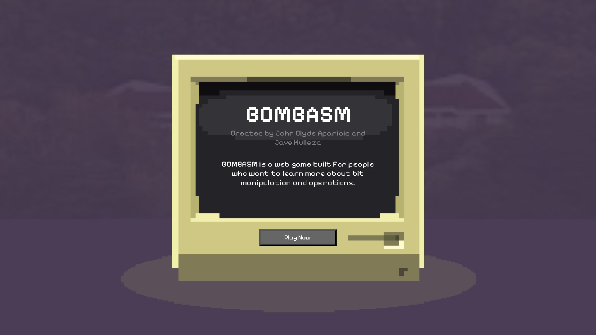
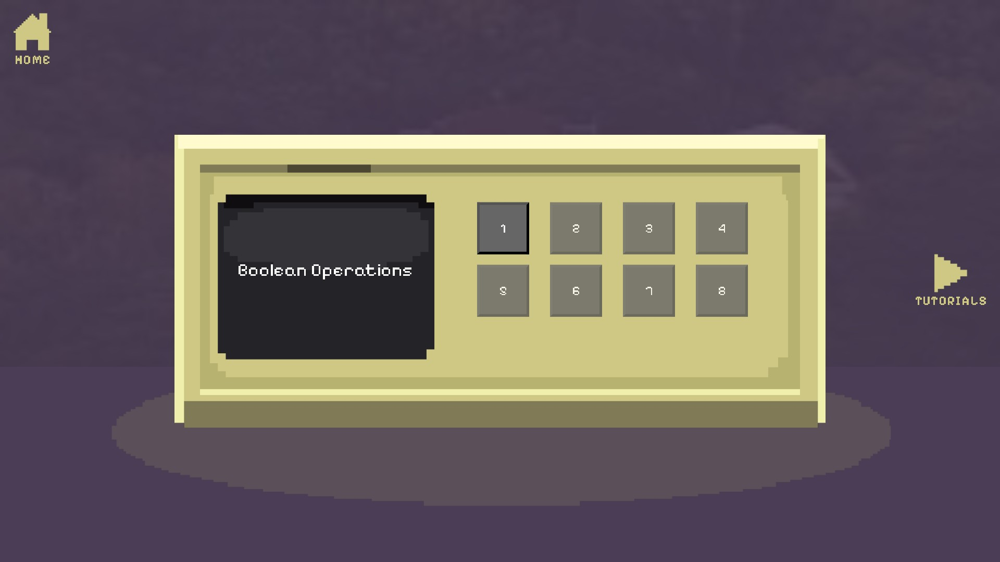
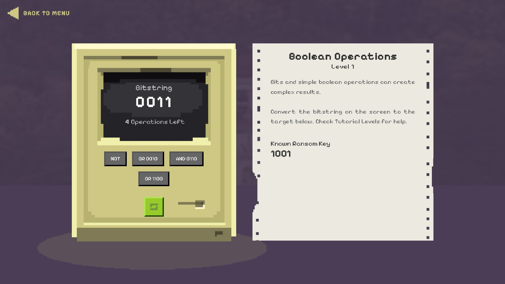
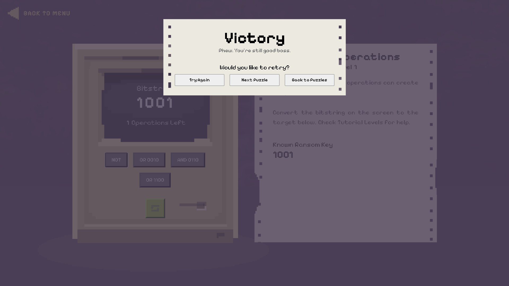
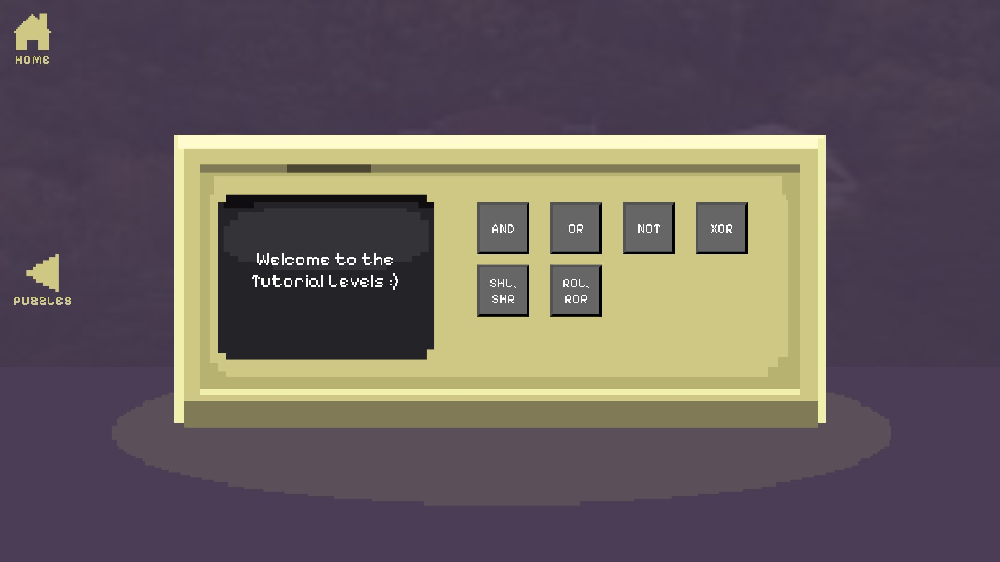
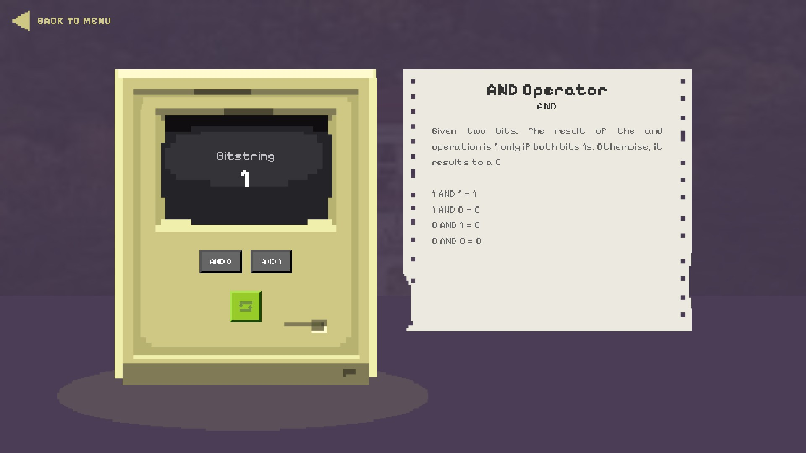

# BOMBASM

Created by:

- John Clyde Aparicio
- Christian Jave Hulleza

## Introduction

BOMBASM is a browser-based bit-manipulation puzzle game built for learning and practicing core bitwise operations through interactive tutorials and progressively harder puzzle levels.

## Tech Stack

- HTML
- CSS
- JavaScript
- C (compiled to WebAssembly via Emscripten)
- WebAssembly modules:
  - `GameLogicModule` (`src/bitstring-operations/game_logic.*`)
  - `PuzzleLevelsModule` (`src/get-puzzle-levels/script.*`)
  - `TutorialLevelsModule` (`src/get-tutorial-levels/script.*`)

## Functions

- Home screen with animated intro text and background music.
- Puzzle level selection with locked/unlocked progression using `sessionStorage`.
- Tutorial level selection for operation-specific guided learning.
- Puzzle gameplay loop:
  - Start bitstring vs target bitstring
  - Limited operation count
  - Win modal (unlocks next level)
  - Loss modal with explosion sequence (audio + GIF effects)
- Core bitwise operations through WASM:
  - `AND`, `OR`, `NOT`, `XOR`, `SHL`, `SHR`, `ROL`, `ROR`
- Dynamic music switching per page and puzzle level.
- Button hover/click SFX across menus and gameplay screens.

## Assets

- Images: `assets/`
  - Background, overlays, UI buttons/icons
  - Explosion GIF set (`assets/explosions/*.gif`)
  - Composite mockups (`home-comp.png`, `level-comp.png`, `puzzle-comp*.png`)
- Audio: `audio/`
  - UI tracks (`audio/UI/*.ogg`, `*.wav`)
  - Button SFX (`audio/buttons/*.wav`)
  - Explosion SFX (`audio/explosions/*`)

## Screenshots

Current repository screenshots/composite captures:








## Tutorials

In-game tutorial levels are available from the Tutorials menu and currently cover:

- AND
- OR
- NOT
- XOR
- SHL / SHR
- ROL / ROR

Each tutorial loads explanatory text plus interactive operation buttons applied to a starter bitstring.

## Installation

### Prerequisites

- A modern browser with WebAssembly support
- A local HTTP server (required for `.wasm` loading)
- Optional (for rebuilding WASM): Emscripten (`emcc`)

### Run Locally

The project can now run from either:
- the `BOMBASM` folder as server root, or
- a parent folder containing `BOMBASM`.

1. Recommended (VS Code Live Server):
- Open either `BOMBASM` or its parent folder in VS Code.
- Start Live Server.
- If your server root is `BOMBASM`: open `http://127.0.0.1:5500/index.html`
- If your server root is parent of `BOMBASM`: open `http://127.0.0.1:5500/BOMBASM/index.html`

2. CLI server (Node):
- Open PowerShell inside `BOMBASM` (or in its parent folder).
- Run:

```powershell
npx serve . -l 5500
```

- Then open:

```text
http://localhost:5500/index.html
```

### Optional: Rebuild WebAssembly Artifacts

If you update C sources, rebuild each module with Emscripten (example commands):

```powershell
emcc src/bitstring-operations/game_logic.c -o src/bitstring-operations/game_logic.js -s MODULARIZE=1 -s EXPORT_NAME=GameLogicModule -s EXPORTED_RUNTIME_METHODS='["cwrap"]' -s EXPORTED_FUNCTIONS='["_bitStringOperations"]'
emcc src/get-puzzle-levels/script.c -o src/get-puzzle-levels/script.js -s MODULARIZE=1 -s EXPORT_NAME=PuzzleLevelsModule -s EXPORTED_RUNTIME_METHODS='["cwrap"]'
emcc src/get-tutorial-levels/script.c -o src/get-tutorial-levels/script.js -s MODULARIZE=1 -s EXPORT_NAME=TutorialLevelsModule -s EXPORTED_RUNTIME_METHODS='["cwrap"]'
```

### Folder Structure

```text
BOMBASM/
├── assets/                      # Images, icons, overlays, explosion GIFs
│   └── explosions/
├── audio/                       # UI, button, and explosion sound assets
│   ├── UI/
│   ├── buttons/
│   └── explosions/
├── puzzle/                      # Puzzle gameplay page
├── puzzle-levels/               # Puzzle level selection page
├── tutorial/                    # Tutorial gameplay page
├── tutorial-levels/             # Tutorial level selection page
├── src/
│   ├── bitstring-operations/    # Core bitwise logic (C + JS/WASM build outputs)
│   ├── get-puzzle-levels/       # Puzzle metadata (C + JS/WASM build outputs)
│   └── get-tutorial-levels/     # Tutorial metadata (C + JS/WASM build outputs)
├── global.js                    # Shared audio/effects/helpers
├── global.css                   # Shared global styles
├── index.html                   # Home page
├── index.js                     # Home page logic
├── index.css                    # Home page styles
├── music.html                   # Hidden iframe music player
└── README.md
```

## Issues

Known issues in the current codebase:

- `global.js` hardcodes `/BOMBASM/...` asset/audio paths, which breaks if hosted under a different base path.

## Licenses

- This game was created as a passionate machine problem for CMSC 131 - Introduction to Computer Organization & Machine Level Programming.
- All Credits of Sounds and GIFs goes to their respective owners.
- Sprites were custom built by the creators and is free for personal, non-commercial use.
